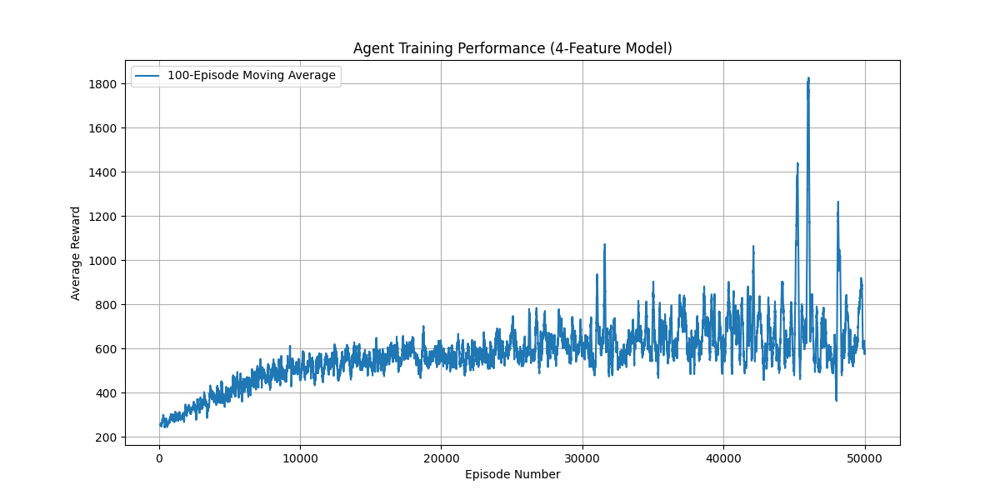

# Ms. Pac-Man Q-Learning Agent

This project is an implementation of a Q-Learning agent designed to play the Atari 2600 game Ms. Pac-Man. The agent uses a custom, low-dimensional state representation (feature engineering) to overcome the "Curse of Dimensionality" and learn an effective policy.

This project was developed in Python using `gymnasium` and the Arcade Learning Environment (ALE).

## Demo & Results

The agent was trained over multiple 50,000-episode runs. The final 4-feature model (`q_table.pkl`) is included in this repository.

### Agent Performance

The agent's performance is highly sensitive to the initial random seed, demonstrating the classic challenge of "local optima" in reinforcement learning.

* **Bad Seed:** The agent learns a suboptimal "hiding" policy and scores **~70 points**.
* **Good Seed:** The agent learns a robust "pellet-seeking" policy and achieves an average score of **~500-700+ points**.

Below is a video of the trained agent (from a successful run) playing with 100% exploitation (no random moves).

<video src="https://github.com/user/repo/blob/main/videos/eval-seed-1337-episode-9.mp4" controls="controls" style="max-width: 720px;">
  Your browser does not support the video tag.
</video>

*(Note: You must upload this project to a GitHub repository and replace the `github.com/user/repo/blob/main` URL with your own repository's URL for the video to embed correctly.)*

### Training Analysis

The agent's policy was learned over 50,000 episodes. The graph below shows the 100-episode moving average reward vs. the exploration rate ($\epsilon$) during one of the training runs.



## Project Goal

The primary goal was to solve the Ms. Pac-Man environment using classic Q-Learning. This was an iterative process:

1.  **Model 1 (3-Features):** A baseline model `(GhostDist, FruitDist, PlayerDir)` was created. This model **failed**, as it learned to hide in a corner ("state blindness").
2.  **Model 2 (4-Features):** A new feature, `DotsEatenBin`, was added to incentivize progress. This model was **successful**, but its success was found to be highly sensitive to the initial random seed.

## File Structure

* `agent.py`: Contains the `Agent` class, which manages the Q-Table and implements the Q-Learning update rule.
* `feature_engineer.py`: Contains the `FeatureEngineer` class, responsible for converting the 128-byte RAM vector into our 4-feature state.
* `train.py`: The main script for training the agent from scratch.
* `evaluate.py`: The script to evaluate a pre-trained agent and **record videos**.
* `plot.py`: A utility to generate the performance and distribution graphs from `training_data.pkl`.
* `q_table.pkl`: **The pre-trained brain** of our successful agent.
* `training_data.pkl`: The raw reward and epsilon data from the final 50,000-episode training run.
* `training_performance.png`: The generated plot of training performance.
* `videos/`: A folder containing demo videos, including `eval-seed-1337-episode-9.mp4`.
* `run_project.sh`: A helper script to run the full train-evaluate-plot pipeline.

## How to Run

### 1. Clone & Install

First, clone this repository and install the required Python packages.

```bash
# Clone the repository
git clone [https://github.com/your-username/your-repo-name.git](https://github.com/your-username/your-repo-name.git)
cd your-repo-name

# Install dependencies
pip install gymnasium[atari]
pip install numpy
pip install matplotlib
pip install moviepy
```

### 2. Evaluate (Quick Start)

This is the fastest way to see the agent in action. This command loads the **pre-trained `q_table.pkl`** and runs 10 games, saving the video files to the `videos/` folder.

```bash
python3 evaluate.py
```
After running, you can find the `.mp4` files in the `videos` directory.

### 3. Train from Scratch (Full Run)

If you want to re-run the 50,000-episode training, use the `train.py` script. This will **overwrite** the existing `q_table.pkl` and `training_data.pkl` files and will take several hours.

```bash
# Run the full training (this takes a long time)
python3 train.py

# After training, evaluate your new agent
python3 evaluate.py

# Finally, generate the plots from your new data
python3 plot.py
```

### 4. Running with a Specific Seed

The agent's performance is sensitive to the random seed. You can specify a seed for training and evaluation.

```bash
# Train with a specific seed
python3 train.py --seed 42

# Evaluate with a specific seed
python3 evaluate.py --seed 1337
```

## Note on `MSPACMAN.BIN`

This project uses the `gymnasium` library, as recommended by the modern `ALE README` documentation. The `gymnasium[atari]` package includes the `AutoROM` utility, which automatically provides the `MSPACMAN.BIN` ROM to the emulator when `gym.make("ALE/MsPacman-v5")` is called.

## References

* [Arcade Learning Environment (ALE) README](https://github.com/mgbellemare/Arcade-Learning-Environment/blob/master/README.md)
* [Gymnasium Documentation](https://gymnasium.farama.org/)
* [Atari RAM Mappings](https://web.archive.org/web/20190124090919/http://www.atarimania.com/game-atari-2600-vcs-pac-man_10129.html)
